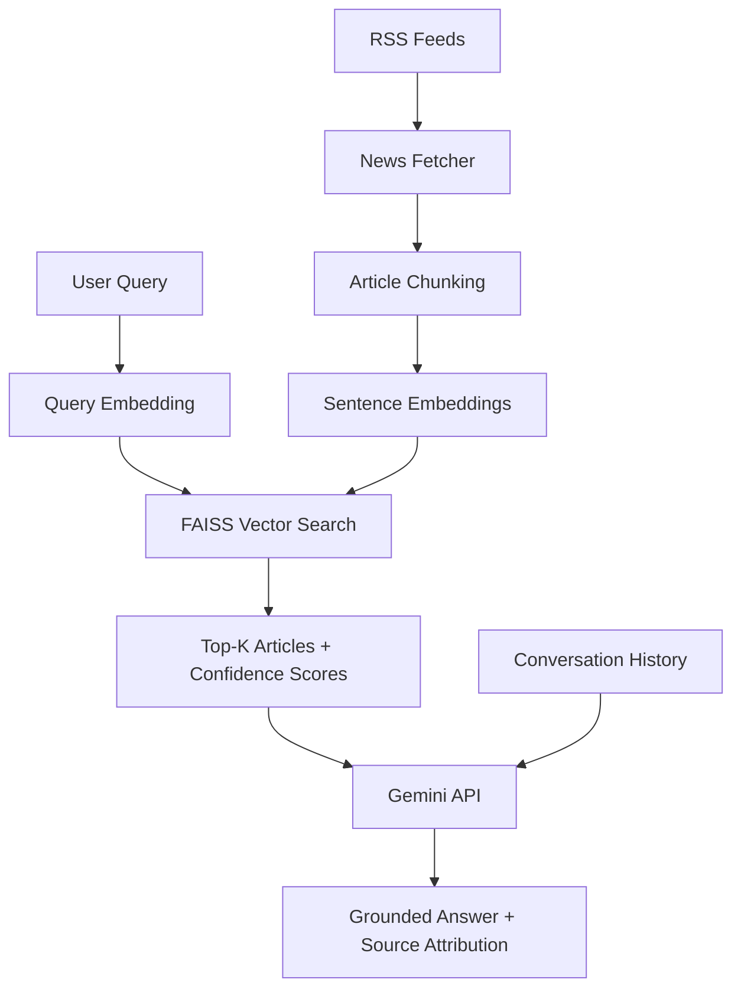

# 📰 News Intelligence Chatbot (RAG-Powered)

A conversational AI application that fetches live news from multiple sources and answers user questions using Retrieval-Augmented Generation (RAG), with conversation memory, confidence-scored retrieval, and a hybrid fallback to general knowledge when live news doesn't cover the topic.

## Overview

Traditional LLMs are limited by their training cutoff and have no knowledge of current events. This project solves that by combining real-time news retrieval with generative AI, ensuring answers are grounded in up-to-date, verifiable sources — while remaining transparent about when an answer comes from live news versus the model's general knowledge.

## Key Features

- **Live news ingestion** from multiple RSS feeds (BBC, NDTV, Google News India)
- **Semantic search** using sentence embeddings and FAISS vector indexing
- **Confidence-scored retrieval** — every source is shown with an approximate relevance percentage
- **Conversation memory** — recent exchanges are passed into each prompt, enabling natural follow-up questions
- **Hybrid answer generation** — prioritizes retrieved news, falls back to general knowledge with clear source labeling
- **Source attribution** — every answer links back to the original articles used
- **Analytics dashboard** — live chart of article distribution across sources
- **Optimized performance** via cached embedding model loading
- **Containerized & tested** — ships with a Dockerfile and a pytest suite for CI-readiness

## Architecture Diagram



## Module Breakdown

| Module | Responsibility |
|---|---|
| `news_fetcher.py` | Fetches and parses articles from RSS feeds |
| `rag_pipeline.py` | Generates embeddings, manages the FAISS vector store, computes relevance scores |
| `answer_generator.py` | Constructs prompts (with conversation history), generates hybrid answers via the Gemini API |
| `app.py` | Streamlit front-end tying all components together |
| `tests/` | Unit tests for chunking and feed-parsing logic (network-independent, mocked) |

## How It Works

1. The user triggers a news fetch, pulling articles across selected RSS sources.
2. Each article is embedded into a vector representation using `sentence-transformers` (`all-MiniLM-L6-v2`).
3. Vectors are indexed in FAISS for fast similarity search.
4. On each query, the query is embedded and the top-5 most relevant articles are retrieved, each with a confidence score.
5. Retrieved articles, the confidence scores, recent conversation history, and the query are passed to Gemini, which generates a grounded answer — falling back to general knowledge (clearly labeled) if retrieved articles are insufficient.
6. Sources and relevance scores are displayed alongside the answer for full transparency.

## Tech Stack

- **Frontend**: Streamlit
- **Embeddings**: sentence-transformers (local, no API cost)
- **Vector Search**: FAISS
- **LLM**: Google Gemini API
- **Data Source**: RSS feeds (feedparser)
- **Testing**: pytest
- **Deployment**: Docker / Streamlit Community Cloud

## Setup Instructions

### Prerequisites
- Python 3.9+
- A free Google Gemini API key from [aistudio.google.com/apikey](https://aistudio.google.com/apikey)

### Installation

```bash
git clone <your-repo-url>
cd news_rag_chatbot
pip install -r requirements.txt
```

### Configure Your API Key (One-Time Setup)

To avoid re-entering your API key every time you run the app, create a `.env` file:

```bash
cp .env.example .env
```

Open `.env` and replace the placeholder with your actual key:
```
GEMINI_API_KEY=your_actual_key_here
```

The app automatically loads this key on every run. The `.env` file is excluded from version control via `.gitignore`, so your key stays private.

### Configure Google Sign-In (Optional)

The app supports "Continue with Google" login in addition to email/password. To enable it:

1. Go to [Google Cloud Console](https://console.cloud.google.com/) and create a new project (or use an existing one).
2. Navigate to **APIs & Services → OAuth consent screen**, choose **External**, and fill in the basic app details.
3. Navigate to **APIs & Services → Credentials → Create Credentials → OAuth Client ID**.
   - Application type: **Web application**
   - Authorized redirect URI: `http://localhost:8501/oauth2callback`
4. Copy the generated **Client ID** and **Client Secret**.
5. Create `.streamlit/secrets.toml` (copy from `secrets.toml.example`) and fill in your credentials:
   ```toml
   [auth]
   redirect_uri = "http://localhost:8501/oauth2callback"
   cookie_secret = "any_random_long_string"

   [auth.google]
   client_id = "your_client_id.apps.googleusercontent.com"
   client_secret = "your_client_secret"
   server_metadata_url = "https://accounts.google.com/.well-known/openid-configuration"
   ```
6. Install the auth dependency: `pip install Authlib`

If this isn't configured, the app simply falls back to email/password login — Google Sign-In is optional.

### Run the App

```bash
streamlit run app.py
```

The app opens at `http://localhost:8501`. Click **Fetch Latest News**, then start asking questions.

## Running Tests

```bash
pip install pytest
pytest tests/ -v
```

## Running with Docker

```bash
docker build -t news-rag-chatbot .
docker run -p 8501:8501 --env-file .env news-rag-chatbot
```

Then open `http://localhost:8501`.

## Deployment (Streamlit Community Cloud)

1. Push this repository to GitHub (the `.env` file will not be included, since it's gitignored).
2. Go to [share.streamlit.io](https://share.streamlit.io) and sign in with GitHub.
3. Click **New app**, select this repository, and set `app.py` as the entry point.
4. Under **Advanced settings → Secrets**, add:
   ```
   GEMINI_API_KEY = "your_actual_key_here"
   ```
5. Deploy — you'll receive a live shareable link within a few minutes.

## Resume Summary

> Built a RAG-based news chatbot combining sentence embeddings, FAISS vector search, and the Gemini API, featuring conversation memory, confidence-scored retrieval, and hallucination-resistant hybrid answer generation. Containerized with Docker and covered by an automated pytest suite.

## Future Improvements

- Add more diverse and category-specific RSS sources
- Improve chunking strategy for longer articles (semantic/sliding-window chunking)
- Add persistent vector storage so news doesn't need to be re-fetched on restart
- Add category-based filtering (Tech, Business, World, etc.)
- Add a reranking step (cross-encoder) on top of FAISS retrieval for higher precision
